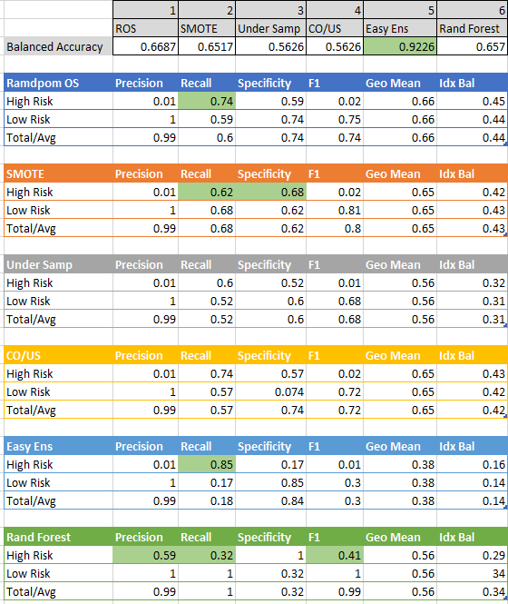

# Credit Risk Analysis  
## Purpose of Analysis

The purpose of this analysis is to use six different machine learning models to evaluate credit risk across several accounts.  The target data, loan status, is either low-risk, value of "1", or high-risk, value of "0".   The models will be evaluated on their ability to detect high-risk loans.

## Results of Analysis

All six models were run using the same data set and using get_dummies to convert string fields to numeric.  The drop_first option was also used to reduce the number of columns without impairing the modeling ability.

A summary of the Balanced Accuracy and Classification Report for each model is shown below.

