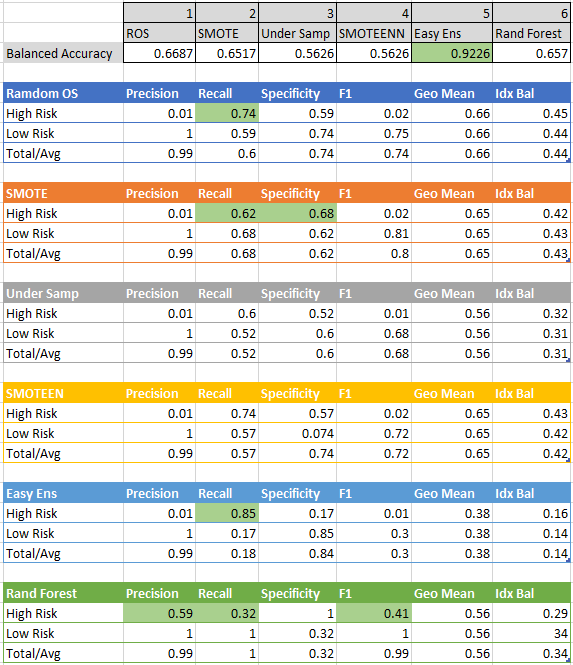

# Credit Risk Analysis  
## Purpose of Analysis

The purpose of this analysis is to use six different machine learning models to evaluate credit risk across several accounts.  The target data, loan status, is either low-risk, value of "1", or high-risk, value of "0".   The models will be evaluated on their ability to detect high-risk loans.

## Results of Analysis

All six models were run using the same data set and using get_dummies to convert string fields to numeric.  The drop_first option was also used to reduce the number of columns without impairing the modeling ability.

A summary of the Balanced Accuracy and Classification Report for each model is shown below.

### Model Summaries

- Random Oversampling - The Random Oversampling model produced a Balanced Accuracy of 66.8%.  The Precision for "High-Risk" loans was low at 1% buth the Recall was high at 74%.  Given the F1 score of 0.02, the model overall did not product great results.
- SMOTE - The SMOTE model yielded a Balanced Accuracy very similar to the Random Oversampling at 65.1% and very similar Recall, 0.62, and F1 score of 0.02.  Again this model given the low F1 score did not provide great results.
- Under Sampling - The Under Samplng model Balanced Accuracy was quite a bit lower than the prior two models at 56.2%.  The Precision, Recall and F1 scores were very similar to the prior two models and overall this model did not provide better results.
- Combined Over/Under Sampling - SMOTEENN - This model produced results very similar to the Under Sampling model.  The Balanced Accuracy was 56.2% and the Precision was 0.01, Recall was 0.74 and F1 was 0.02.  Recall was in line with Random Oversampling model and the F1 was marginally improved.  But again, this model did not provide great results given the F1 score.
- Easy Ensemble - This model yielded much the same results as the other on Precision and F1. This model had the highest Balanced Accuracy score of 92.2%.  The Recall improved to 0.85.  The low F1 score for High-Risk was not better than the prior models.
- Randdom Forest - Overall this model provided the best results in Precision, Recall and F1 score.  The Balanced Accuracy was similar to Random Oversmapling and SMOTE at 65.7%.  However the Precision was 0.59, Recall was 0.32 and the F1 score was 0.41.  All three metrics were the best performing of the six models.  

## Sumary and Conclusions
Overall the Random Forest model produced the best results for predicting "High-Risk" loans.  The results were encouraging but there should be additional work to refine the model.

Additional work to improved the model would be to refine the existing data, review data sources for additional data that might improve predictability and finally sensitivity test the Random Forest model with other parameter sets to imrpove performance.
